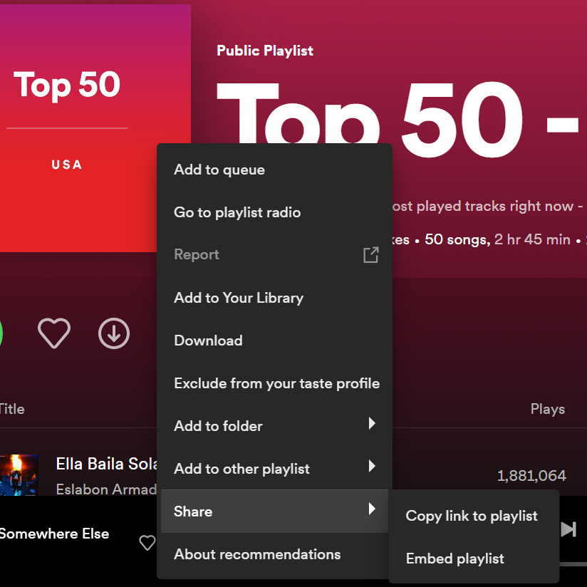

[](https://classroom.github.com/a/dyrs3KiQ)

**Spotify-Discovery Package**

The purpose of the package is to help users decide what songs to listen
to when they are unsure of what songs to play next. The package will be
needed to connect to the Spotify API, as users will need to create an
access token as well use their username and uri to connect to their
Spotify account. Our package will organize songs for listeners who do
not know how to organize their listening habits. The package contains
different functions which will outcome different data frames based on
what you want to listen to. Love your Spotify Discover Weekly but don't
know where to start? We have a function that will just shuffle your
playlist for you. Want to listen to new songs that are similar to your
favorite ones? We also have a function that will recommend you similar
songs/genres that you are currently listening to.

**Package Purpose and Functions**

The Spotify Discovery package allows users to engage with Spotify's API
to enhance their ability to interact with their Spotify account beyond
the functions available on Spotify's official user base platform. Two
types of functions reside in this package; (1) playlist manipulation
functions and (2) audio feature functions.

Playlist manipulation functions include:

-   `genre_playlist_recommendations()`

-   `ranking_function()`

The playlist manipulation functions are valuable additions to a user's
interaction with their playlists because they offer the user
manipulation functions that allow further customization to a user's
playlist beyond tools on Spotify's platform.

Audio feature functions include:

-   `playlist_averages()`

-   `shuffled_playlist()`

-   `max_metrics_summary()` and `min_metrics_summary()`

The audio feature functions are an important addition to a user's
interaction with their data because the music metric data is unavailable
to the user through the Spotify interface, but is well documented and
accessible via the spotifyr package. The Spotify Discovery package's
audio feature functions make engaging with Spotify's archival music
metric data accessible to users who may not be fluent in music and audio
metric data. The benefits of including audio functions include
increasing a user's ability to measure and place songs into a playlist
based on music metrics data.

**Package Installation**

To install the package, run the following code chunk:

```{r}
devtools::install_github("Adv-R-Programming/final-project-spotify-discover")
```

The package requires a personal API token and individual Spotify URI
codes. After the package is installed, the first thing you need to do is
create an API application and create your personal API access token. You
can find out how to do that with the `api_token` vignette! All of the
functions require a Spotify URI for whatever playlist or artist you want
to perform an analysis on. To get the Spotify URI, you must be on a
computer. Follow the below steps.

1.  Search up whatever playlist or artist you want to perform an
    analysis on

2.  Click on the three dots


3.  Go down to the "Share" section



4.  Hold Alt and click on the part that says "Copy Spotify URI"


6.  Paste into an R function and delete the "<spotify:playlist>:"
    section preceding the unique URI

7.  Put the unique URI in quotes

You are done! Analyze any playlist or artist with their URI and your API
access token.

**Example of Usage**

The goal of the package is to help users learn more and use the different music metrics in their Spotify playlist based on what is provided by the Spotify API. 


Let’s say we have a playlist, but we don’t have a lot of time. We can use the `ranking_function()`, by giving it a playlist URI, access token, and telling the function to `sort_by track.duration_ms` (a column in a dataframe) so we get a dataframe with songs with the shortest duration to the longest duration by milliseconds. This helps us organize our playlist so we know what songs have the shortest time if we only have time for a few songs. 


Let’s also say we have a favorite artist, but we’ve listened to all their songs so we want to start listening to someone new. We can use the `genre_recommendations()` function by providing your favorite artist’s URI and our access token and this function will recommend 20 artists per genre of your favorite artist. So let’s say our favorite artist is Fujii Kaze, we can run `genre_recommendations('6bDWAcdtVR3WHz2xtiIPUi', access_token)` and get some new artist recommendations! 


[](https://classroom.github.com/a/dyrs3KiQ)
